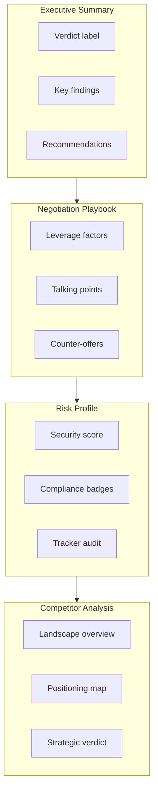
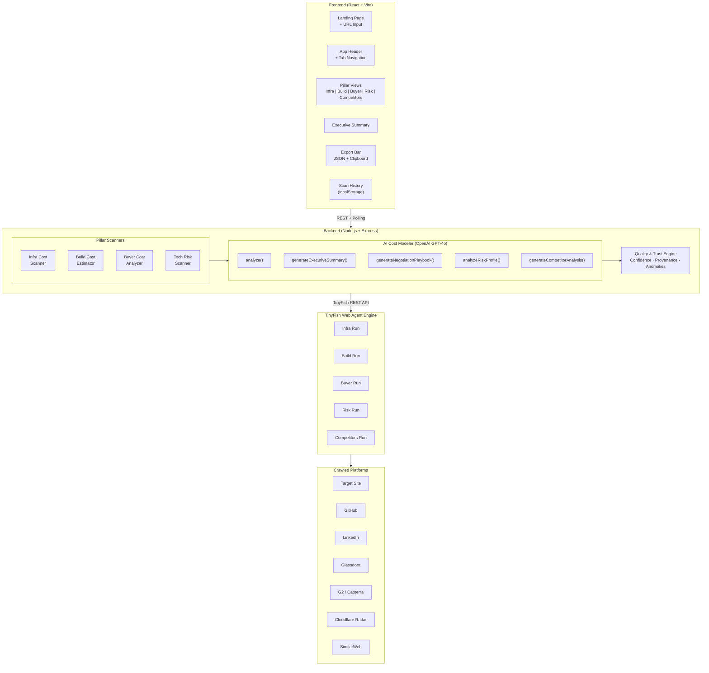
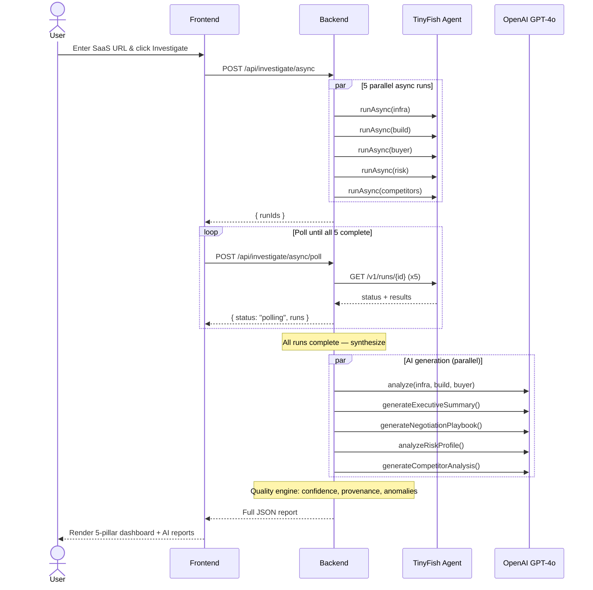
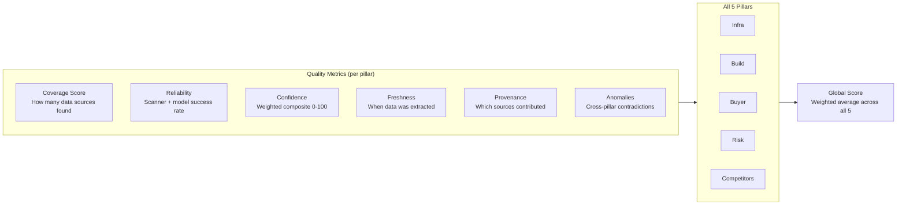

# CostLens — Analyze Any SaaS Down to Its True Cost

**Five pillars. AI synthesis. Complete cost & competitive transparency.**

Paste any SaaS URL and CostLens uses **TinyFish Web Agent** stealth automation + **OpenAI GPT-4o** to investigate across 10+ bot-protected platforms — answering questions no other tool can:

1. **What does it cost THEM to run?** — Reverse-engineer infrastructure costs, reveal true margins
2. **What would it cost to BUILD?** — Module-by-module replication estimate with team size and timeline
3. **What does it ACTUALLY cost YOU?** — Hidden fees, SSO surcharges, AI add-ons, overage charges
4. **What are the RISKS?** — Security headers, compliance posture, third-party trackers
5. **Who are the COMPETITORS?** — Discover alternatives, compare positioning, pricing, and strengths

> **A TinyFish Web Agent showcase** — demonstrating capabilities impossible without stealth web automation.

---

## Features at a Glance

| Feature | Description |
|---------|-------------|
| **5-Pillar Analysis** | Infra cost, Build cost, Buyer cost, Risk profile, Competitor radar |
| **AI Executive Summary** | GPT-4o synthesizes all pillars into a verdict with key findings |
| **Negotiation Playbook** | Leverage factors, talking points, counter-offer suggestions |
| **Competitor Radar** | Discovers alternatives, maps price vs. feature positioning |
| **Technology Risk Scanner** | Security headers, compliance badges, third-party tracker audit |
| **Scan History** | Browser-local history of past scans with one-click reload |
| **Report Export** | Download JSON or copy a text summary to clipboard |
| **Quality & Trust System** | Per-pillar confidence scores, provenance tracking, anomaly detection |
| **Async Polling** | Non-blocking scans with real-time progress via polling |

---

## The Problem

SaaS pricing is deliberately opaque:

- **For investors/analysts**: You can't evaluate a SaaS company's margins without knowing their infrastructure costs — but those costs are concealed behind technical complexity
- **For CTOs**: Build-vs-buy decisions require knowing the true build cost — but nobody can estimate it without deep technical analysis
- **For buyers**: The listed price is rarely the full cost — additional fees inflate costs 30-55% for typical teams
- **For security teams**: Compliance and risk posture are hidden behind marketing pages
- **For strategists**: Competitive positioning requires visiting dozens of sites manually

**CostLens solves all five.**

---

## The Five Pillars

### Pillar 1: Their Cost (Infrastructure)
Reverse-engineers what the SaaS company actually spends to run:
- Cloud compute costs (AWS/GCP/Azure) inferred from CDN headers, response patterns, traffic estimates
- Database costs estimated from API pagination styles and consistency models
- Third-party service costs from detected client-side SDKs (Segment, Datadog, LaunchDarkly, etc.)
- Engineering team costs from LinkedIn headcount x Glassdoor/Levels.fyi salary data
- **Output**: Monthly cost range, per-user cost, estimated gross margin

### Pillar 2: Build Cost (Replication)
Estimates what it would cost to build the product from scratch:
- Feature detection via DOM analysis, network interception, and runtime inspection
- Complexity scoring per module (editor, real-time, auth, search, API, mobile, etc.)
- Team size and timeline estimates based on detected tech stack
- Open-source component identification to reduce build effort
- **Output**: Total cost range, timeline, team size, module-by-module breakdown

### Pillar 3: Your Cost (True TCO)
Uncovers costs the pricing page doesn't show:
- SSO surcharges (enterprise-only SSO forcing tier upgrades)
- AI add-on costs not included in base pricing
- Annual vs monthly billing differentials, minimum seat commitments
- Overage charges identified from G2 reviews and help docs
- **Output**: Plan-by-plan true cost, TCO scenarios, negotiation playbook

### Pillar 4: Risk Profile (Security & Compliance)
Scans the target for technology risk signals:
- HTTP security headers (HSTS, CSP, X-Frame-Options, etc.)
- Compliance badge detection (SOC 2, GDPR, HIPAA, ISO 27001)
- Third-party tracker audit (analytics, advertising, session recording)
- **Output**: Security score, compliance badges, findings, recommendations

### Pillar 5: Competitor Radar
Discovers and analyzes the competitive landscape:
- Finds top 3-5 alternatives via G2, Capterra, comparison pages
- AI-generated positioning map (price level vs. feature richness)
- Per-competitor pros/cons relative to the target
- **Output**: Landscape overview, competitor cards, positioning map, strategic verdict

---

## AI-Powered Reports

Beyond the raw pillar data, CostLens uses OpenAI GPT-4o to generate:



---

## Why Only TinyFish Web Agent Can Do This

| Data Source | Traditional Tools | ChatGPT | **TinyFish + CostLens** |
|---|---|---|---|
| CF-protected pricing pages | Blocked | Stale data | Stealth rendering |
| LinkedIn engineering headcount | Blocked | No access | Authenticated sessions |
| Glassdoor/Levels.fyi salaries | Bot-protected | Outdated | Stealth browsing |
| Cloudflare Radar traffic data | Protected API | No access | Full page rendering |
| G2/Capterra reviews & alternatives | Anti-scrape | N/A | Bot protection bypass |
| Security headers & compliance pages | Manual only | No execution | Real browser context |
| Runtime JS analysis | No browser | No execution | Full Performance API |

---

## Architecture



---

## Scan Flow



---

## Getting Started

```bash
# Clone
git clone <your-repo-url> && cd costlens

# Install dependencies
npm install

# Set up environment
cp .env.example .env
# Edit .env with TINYFISH_API_KEY and OPENAI_API_KEY

# Run
npm run dev

# Open http://localhost:3000
```

Enter a SaaS URL and click **Investigate** to run a live TinyFish-backed scan.

### Environment Variables

| Variable | Required | Default | Description |
|----------|----------|---------|-------------|
| `TINYFISH_API_KEY` | Yes | — | TinyFish Web Agent API key |
| `OPENAI_API_KEY` | Yes | — | OpenAI API key (GPT-4o) |
| `PORT` | No | `3000` | Server port (auto-increments if busy) |
| `CORS_ORIGIN` | No | `localhost` | Allowed CORS origins (comma-separated) |
| `OPENAI_MODEL` | No | `gpt-4o` | OpenAI model to use |
| `TINYFISH_ENDPOINT` | No | `https://agent.tinyfish.ai` | TinyFish API base URL |
| `TINYFISH_BROWSER_PROFILE` | No | `stealth` | `lite` or `stealth` |
| `INVESTIGATION_FAST_MODE` | No | `true` | Use async polling (recommended) |
| `INVESTIGATION_TIMEOUT_MS` | No | `60000` | Max scan duration |

### Vercel Deployment

- This repo is configured for a single Vercel project:
  - Frontend static output: `client/dist`
  - Backend API routes: `/api/*` (serverless function)
- Required Vercel environment variables: `TINYFISH_API_KEY`, `OPENAI_API_KEY`
- `VERCEL_URL` is auto-configured for CORS — no manual origin needed
- Long investigations may require increased function duration in `vercel.json`

### TinyFish API Alignment

Official docs: **[https://docs.mino.ai](https://docs.mino.ai)**

| Endpoint | Usage |
|----------|-------|
| `POST /v1/automation/run` | Synchronous single-pillar scan |
| `POST /v1/automation/run-async` | Start async run (returns `run_id`) |
| `GET /v1/runs/{run_id}` | Poll run status and retrieve results |
| `POST /v1/automation/run-sse` | SSE streaming (sync path) |

- Base URL: `https://agent.tinyfish.ai`
- Auth header: `X-API-Key: $TINYFISH_API_KEY`
- Browser profiles: `lite` or `stealth`
- [Error codes reference](https://docs.mino.ai/error-codes)

---

## Project Structure

```
costlens/
├── client/
│   ├── src/
│   │   ├── App.jsx                        # Main app shell + scan orchestration
│   │   ├── main.jsx                       # React entry point
│   │   ├── views/
│   │   │   ├── LandingView.jsx            # URL input + scan history
│   │   │   ├── InfraView.jsx              # Pillar 1: Infrastructure cost
│   │   │   ├── BuildView.jsx              # Pillar 2: Build cost
│   │   │   ├── BuyerView.jsx              # Pillar 3: Buyer cost + negotiation
│   │   │   ├── RiskView.jsx               # Pillar 4: Risk profile
│   │   │   └── CompetitorView.jsx         # Pillar 5: Competitor radar
│   │   ├── components/
│   │   │   ├── AppHeader.jsx              # Header + tab navigation + home
│   │   │   ├── ReportSummary.jsx          # Trust scores + verification checklist
│   │   │   ├── ExecutiveSummary.jsx        # AI executive summary
│   │   │   ├── NegotiationPlaybook.jsx     # AI negotiation playbook
│   │   │   ├── ExportBar.jsx              # JSON download + clipboard copy
│   │   │   ├── ScanHistory.jsx            # Past scan list (localStorage)
│   │   │   ├── ScanOverlay.jsx            # Progress overlay during scans
│   │   │   ├── Badges.jsx                 # Confidence badges + hints
│   │   │   └── InfraVisualizations.jsx    # Margin gauge, cost bars
│   │   ├── utils/
│   │   │   ├── report.js                  # Report normalization (all 5 pillars)
│   │   │   ├── formatting.js              # Number/text helpers, hasValue
│   │   │   ├── history.js                 # localStorage scan history
│   │   │   └── export.js                  # JSON export + text summary
│   │   └── styles/
│   │       └── tokens.js                  # Design tokens (colors, spacing)
│   ├── index.html
│   └── vite.config.js
├── server/
│   ├── server.js                          # Express API + async polling + quality engine
│   ├── config/index.js                    # Environment config loader
│   ├── tinyfish/
│   │   └── tinyfish-web-agent-client.js   # TinyFish Web Agent REST client
│   ├── services/
│   │   ├── infra-cost-scanner.js          # Pillar 1 scanner
│   │   ├── build-cost-estimator.js        # Pillar 2 scanner
│   │   ├── buyer-cost-analyzer.js         # Pillar 3 scanner
│   │   └── tech-risk-scanner.js           # Pillar 4 scanner
│   └── analysis/
│       └── cost-modeler.js                # AI synthesis (5 generation methods)
├── .env.example
├── package.json
├── vercel.json
└── README.md
```

---

## Quality & Trust System

Every scan produces per-pillar quality metadata:



- Numbers without backing evidence are **hidden, not guessed**
- Degraded pillars show warning badges in the tab bar
- The verification checklist shows scanner/model status for all pillars

---

## Business Model

| Tier | Price | Scans | Features |
|------|-------|-------|----------|
| **Free** | $0 | 3/month | All five pillars, basic report |
| **Pro** | $79/mo | 50/month | PDF export, historical tracking, alerts |
| **Team** | $249/mo | Unlimited | API access, custom competitors, Slack alerts |
| **Enterprise** | Custom | Unlimited | On-prem, white-label, bulk analysis |

**Target markets**: VC/PE due diligence, SaaS procurement teams, CTOs evaluating build-vs-buy, competitive intelligence analysts, security & compliance teams.

---

## License

Proprietary — TinyFish Solutions. All rights reserved.

---

<p align="center">
  <strong>Built with <a href="https://agent.tinyfish.ai">TinyFish Web Agent</a> + <a href="https://platform.openai.com">OpenAI</a></strong><br>
  <em>Complete SaaS cost & competitive intelligence, powered by stealth web automation and AI.</em>
</p>
