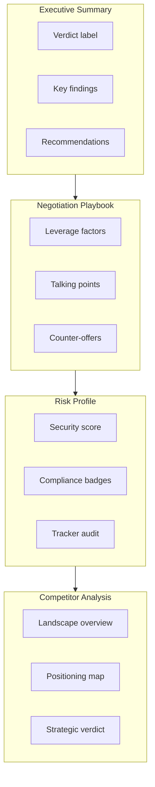
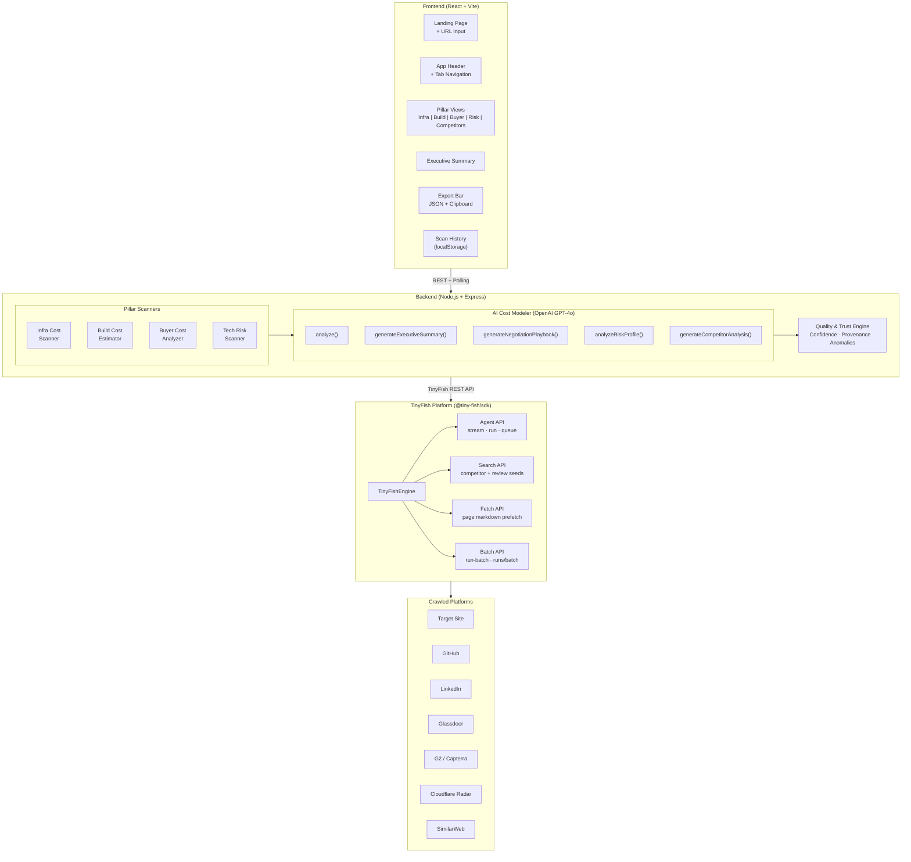
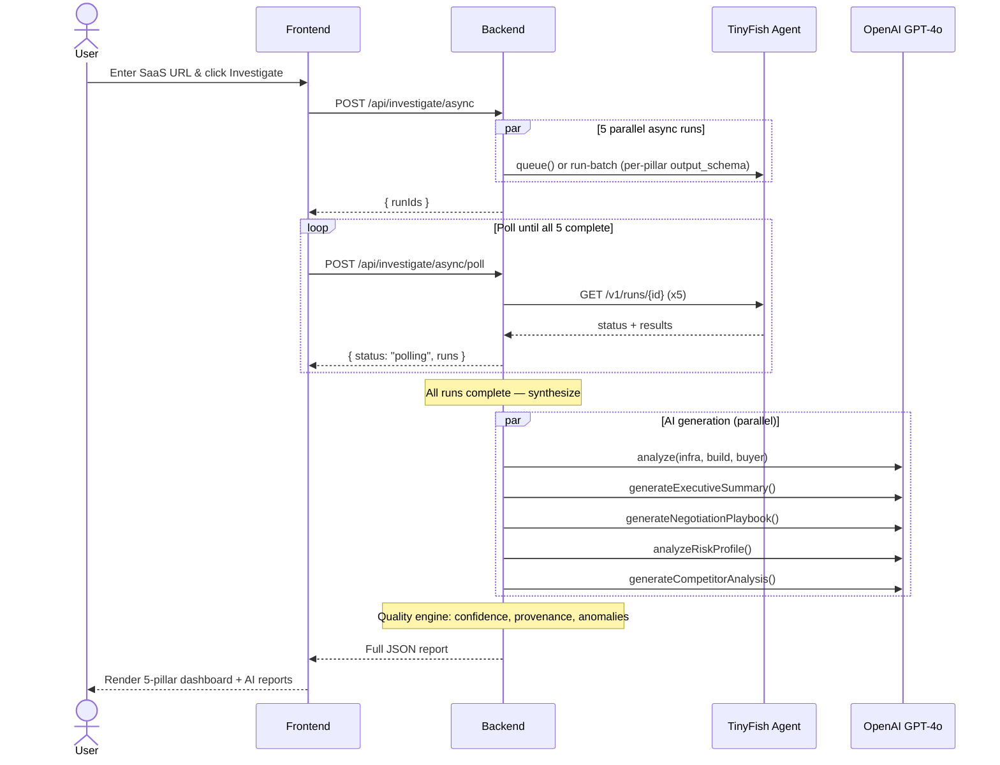
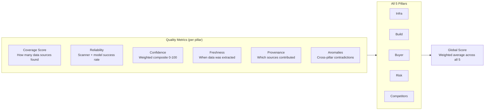

# CostLens — Analyze Any SaaS Down to Its True Cost

**Five pillars. AI synthesis. Complete cost & competitive transparency.**

Paste any SaaS URL and CostLens uses **TinyFish Web Agent** stealth automation + **OpenAI GPT-4o** to investigate across 10+ bot-protected platforms — answering questions no other tool can:

1. **What does it cost THEM to run?** — Reverse-engineer infrastructure costs, reveal true margins
2. **What would it cost to BUILD?** — Module-by-module replication estimate with team size and timeline
3. **What does it ACTUALLY cost YOU?** — Hidden fees, SSO surcharges, AI add-ons, overage charges
4. **What are the RISKS?** — Security headers, compliance posture, third-party trackers
5. **Who are the COMPETITORS?** — Discover alternatives, compare positioning, pricing, and strengths

> **A TinyFish Web Agent showcase** — demonstrating capabilities impossible without stealth web automation.

---

## Features at a Glance

| Feature | Description |
|---------|-------------|
| **5-Pillar Analysis** | Infra cost, Build cost, Buyer cost, Risk profile, Competitor radar |
| **AI Executive Summary** | GPT-4o synthesizes all pillars into a verdict with key findings |
| **Negotiation Playbook** | Leverage factors, talking points, counter-offer suggestions |
| **Competitor Radar** | Discovers alternatives, maps price vs. feature positioning |
| **Technology Risk Scanner** | Security headers, compliance badges, third-party tracker audit |
| **Scan History** | Browser-local history of past scans with one-click reload |
| **Report Export** | Download JSON or copy a text summary to clipboard |
| **Quality & Trust System** | Per-pillar confidence scores, provenance tracking, anomaly detection |
| **Async Polling** | Non-blocking scans with real-time progress via polling |

---

## The Problem

SaaS pricing is deliberately opaque:

- **For investors/analysts**: You can't evaluate a SaaS company's margins without knowing their infrastructure costs — but those costs are concealed behind technical complexity
- **For CTOs**: Build-vs-buy decisions require knowing the true build cost — but nobody can estimate it without deep technical analysis
- **For buyers**: The listed price is rarely the full cost — additional fees inflate costs 30-55% for typical teams
- **For security teams**: Compliance and risk posture are hidden behind marketing pages
- **For strategists**: Competitive positioning requires visiting dozens of sites manually

**CostLens solves all five.**

---

## The Five Pillars

### Pillar 1: Their Cost (Infrastructure)
Reverse-engineers what the SaaS company actually spends to run:
- Cloud compute costs (AWS/GCP/Azure) inferred from CDN headers, response patterns, traffic estimates
- Database costs estimated from API pagination styles and consistency models
- Third-party service costs from detected client-side SDKs (Segment, Datadog, LaunchDarkly, etc.)
- Engineering team costs from LinkedIn headcount x Glassdoor/Levels.fyi salary data
- **Output**: Monthly cost range, per-user cost, estimated gross margin

### Pillar 2: Build Cost (Replication)
Estimates what it would cost to build the product from scratch:
- Feature detection via DOM analysis, network interception, and runtime inspection
- Complexity scoring per module (editor, real-time, auth, search, API, mobile, etc.)
- Team size and timeline estimates based on detected tech stack
- Open-source component identification to reduce build effort
- **Output**: Total cost range, timeline, team size, module-by-module breakdown

### Pillar 3: Your Cost (True TCO)
Uncovers costs the pricing page doesn't show:
- SSO surcharges (enterprise-only SSO forcing tier upgrades)
- AI add-on costs not included in base pricing
- Annual vs monthly billing differentials, minimum seat commitments
- Overage charges identified from G2 reviews and help docs
- **Output**: Plan-by-plan true cost, TCO scenarios, negotiation playbook

### Pillar 4: Risk Profile (Security & Compliance)
Scans the target for technology risk signals:
- HTTP security headers (HSTS, CSP, X-Frame-Options, etc.)
- Compliance badge detection (SOC 2, GDPR, HIPAA, ISO 27001)
- Third-party tracker audit (analytics, advertising, session recording)
- **Output**: Security score, compliance badges, findings, recommendations

### Pillar 5: Competitor Radar
Discovers and analyzes the competitive landscape:
- Finds top 3-5 alternatives via G2, Capterra, comparison pages
- AI-generated positioning map (price level vs. feature richness)
- Per-competitor pros/cons relative to the target
- **Output**: Landscape overview, competitor cards, positioning map, strategic verdict

---

## AI-Powered Reports

Beyond the raw pillar data, CostLens uses OpenAI GPT-4o to generate:


```mermaid
graph TD
  subgraph ES["Executive Summary"]
    ES1["Verdict label"]
    ES2["Key findings"]
    ES3["Recommendations"]
  end
  subgraph NP["Negotiation Playbook"]
    NP1["Leverage factors"]
    NP2["Talking points"]
    NP3["Counter-offers"]
  end
  subgraph RP["Risk Profile"]
    RP1["Security score"]
    RP2["Compliance badges"]
    RP3["Tracker audit"]
  end
  subgraph CA["Competitor Analysis"]
    CA1["Landscape overview"]
    CA2["Positioning map"]
    CA3["Strategic verdict"]
  end

  ES --> NP --> RP --> CA
```

---

## Why Only TinyFish Web Agent Can Do This

| Data Source | Traditional Tools | ChatGPT | **TinyFish + CostLens** |
|---|---|---|---|
| CF-protected pricing pages | Blocked | Stale data | Stealth rendering |
| LinkedIn engineering headcount | Blocked | No access | Authenticated sessions |
| Glassdoor/Levels.fyi salaries | Bot-protected | Outdated | Stealth browsing |
| Cloudflare Radar traffic data | Protected API | No access | Full page rendering |
| G2/Capterra reviews & alternatives | Anti-scrape | N/A | Bot protection bypass |
| Security headers & compliance pages | Manual only | No execution | Real browser context |
| Runtime JS analysis | No browser | No execution | Full Performance API |

---

## Architecture


```mermaid
graph TB
  subgraph Frontend["Frontend (React + Vite)"]
    Landing["Landing Page\n+ URL Input"]
    Header["App Header\n+ Tab Navigation"]
    Tabs["Pillar Views\nInfra | Build | Buyer | Risk | Competitors"]
    ExecSum["Executive Summary"]
    Export["Export Bar\nJSON + Clipboard"]
    History["Scan History\n(localStorage)"]
  end

  subgraph Backend["Backend (Node.js + Express)"]
    subgraph Scanners["Pillar Scanners"]
      S1["Infra Cost\nScanner"]
      S2["Build Cost\nEstimator"]
      S3["Buyer Cost\nAnalyzer"]
      S4["Tech Risk\nScanner"]
    end
    subgraph AI["AI Cost Modeler (OpenAI GPT-4o)"]
      A1["analyze()"]
      A2["generateExecutiveSummary()"]
      A3["generateNegotiationPlaybook()"]
      A4["analyzeRiskProfile()"]
      A5["generateCompetitorAnalysis()"]
    end
    Quality["Quality & Trust Engine\nConfidence · Provenance · Anomalies"]
  end

  subgraph TinyFish["TinyFish Platform (@tiny-fish/sdk)"]
    direction LR
    TE["TinyFishEngine"]
    T1["Agent API\nstream · run · queue"]
    T2["Search API\ncompetitor + review seeds"]
    T3["Fetch API\npage markdown prefetch"]
    T4["Batch API\nrun-batch · runs/batch"]
    TE --> T1
    TE --> T2
    TE --> T3
    TE --> T4
  end

  subgraph Sources["Crawled Platforms"]
    direction LR
    P1["Target Site"]
    P2["GitHub"]
    P3["LinkedIn"]
    P4["Glassdoor"]
    P5["G2 / Capterra"]
    P6["Cloudflare Radar"]
    P7["SimilarWeb"]
  end

  Frontend -- "REST + Polling" --> Backend
  Scanners --> AI
  AI --> Quality
  Backend -- "TinyFish REST API" --> TinyFish
  TinyFish --> Sources
```

---

## Scan Flow


```mermaid
sequenceDiagram
  actor User
  participant Client as Frontend
  participant Server as Backend
  participant TF as TinyFish Agent
  participant OpenAI as OpenAI GPT-4o

  User->>Client: Enter SaaS URL & click Investigate
  Client->>Server: POST /api/investigate/async

  par 5 parallel async runs
    Server->>TF: queue() or run-batch (per-pillar output_schema)
  end

  Server-->>Client: { runIds }

  loop Poll until all 5 complete
    Client->>Server: POST /api/investigate/async/poll
    Server->>TF: GET /v1/runs/{id} (x5)
    TF-->>Server: status + results
    Server-->>Client: { status: "polling", runs }
  end

  Note over Server: All runs complete — synthesize

  par AI generation (parallel)
    Server->>OpenAI: analyze(infra, build, buyer)
    Server->>OpenAI: generateExecutiveSummary()
    Server->>OpenAI: generateNegotiationPlaybook()
    Server->>OpenAI: analyzeRiskProfile()
    Server->>OpenAI: generateCompetitorAnalysis()
  end

  Note over Server: Quality engine: confidence, provenance, anomalies

  Server-->>Client: Full JSON report
  Client-->>User: Render 5-pillar dashboard + AI reports
```

---

## Getting Started

```bash
# Clone
git clone <your-repo-url> && cd costlens

# Install dependencies
npm install

# Set up environment
cp .env.example .env
# Edit .env with TINYFISH_API_KEY and OPENAI_API_KEY

# Run
npm run dev

# Open http://localhost:3000
```

Enter a SaaS URL and click **Investigate** to run a live TinyFish-backed scan.

### Environment Variables

Only two variables are required in `.env`:

| Variable | Required | Description |
|----------|----------|-------------|
| `TINYFISH_API_KEY` | Yes | TinyFish Web Agent API key |
| `OPENAI_API_KEY` | Yes | OpenAI API key |

All other settings (models, timeouts, quality scoring, TinyFish browser profile, async strategy, etc.) live in `server/config/index.js` with sensible defaults. Change them there if you need to tune behavior.

Hosting platforms may still inject runtime variables such as `PORT`, `NODE_ENV`, and `VERCEL_URL` — you do not need to set those locally.

### Vercel Deployment

- This repo is configured for a single Vercel project:
  - Frontend static output: `client/dist`
  - Backend API routes: `/api/*` (serverless function)
- Required Vercel environment variables: `TINYFISH_API_KEY`, `OPENAI_API_KEY`
- `VERCEL_URL` is auto-configured for CORS — no manual origin needed
- Long investigations may require increased function duration in `vercel.json`

### TinyFish API Alignment

Official docs: **[https://docs.tinyfish.ai](https://docs.tinyfish.ai)**

CostLens uses the official **`@tiny-fish/sdk`** package via a thin **`TinyFishEngine`** orchestrator (`server/tinyfish/engine.js`) that combines Agent, Search, Fetch, and batch APIs. Pillar goals and `output_schema` definitions live in `server/tinyfish/pillars.js`.

| SDK surface | Usage in CostLens |
|------------|-------------------|
| `client.agent.stream()` | Sync pillar scans with SSE progress (`STREAMING_URL`, `PROGRESS`) |
| `client.agent.run()` | Structured JSON extraction (`output_schema` per pillar) |
| `client.agent.queue()` | Default async strategy — one queued run per pillar with its own schema |
| `client.search.query()` | Competitor discovery + buyer review complaint seeds |
| `client.fetch.getContents()` | Markdown prefetch injected into agent goals (pricing, product, risk) |
| `POST /v1/automation/run-batch` | Optional batch async start (`config.tinyfish.asyncStrategy`) |
| `POST /v1/runs/batch` | Poll all pillar runs in one request |

**Async strategy** (`config.tinyfish.asyncStrategy` in `server/config/index.js`):

- `queue` (default) — five `agent.queue()` calls, each with pillar-specific `output_schema`
- `batch` — single `run-batch` call for atomic multi-pillar start

Underlying REST endpoints (handled by the SDK):

| Endpoint | Usage |
|----------|-------|
| `POST /v1/automation/run-sse` | Streaming pillar scans (progress callbacks) |
| `POST /v1/automation/run` | Synchronous pillar scans |
| `POST /v1/automation/run-batch` | Atomic multi-pillar async start |
| `POST /v1/runs/batch` | Batch poll for async runs |
| `GET /v1/runs/{run_id}` | Single run lookup |

- Base URL: `https://agent.tinyfish.ai`
- Auth: `TINYFISH_API_KEY` env var (read automatically by the SDK)
- Browser profiles: `lite` or `stealth`
- [Agent API reference](https://docs.tinyfish.ai/agent-api/reference)

---

## Project Structure

```
costlens/
├── client/
│   ├── src/
│   │   ├── App.jsx                        # Main app shell + scan orchestration
│   │   ├── main.jsx                       # React entry point
│   │   ├── views/
│   │   │   ├── LandingView.jsx            # URL input + scan history
│   │   │   ├── InfraView.jsx              # Pillar 1: Infrastructure cost
│   │   │   ├── BuildView.jsx              # Pillar 2: Build cost
│   │   │   ├── BuyerView.jsx              # Pillar 3: Buyer cost + negotiation
│   │   │   ├── RiskView.jsx               # Pillar 4: Risk profile
│   │   │   └── CompetitorView.jsx         # Pillar 5: Competitor radar
│   │   ├── components/
│   │   │   ├── AppHeader.jsx              # Header + tab navigation + home
│   │   │   ├── ReportSummary.jsx          # Trust scores + verification checklist
│   │   │   ├── ExecutiveSummary.jsx        # AI executive summary
│   │   │   ├── NegotiationPlaybook.jsx     # AI negotiation playbook
│   │   │   ├── ExportBar.jsx              # JSON download + clipboard copy
│   │   │   ├── ScanHistory.jsx            # Past scan list (localStorage)
│   │   │   ├── ScanOverlay.jsx            # Progress overlay during scans
│   │   │   ├── Badges.jsx                 # Confidence badges + hints
│   │   │   └── InfraVisualizations.jsx    # Margin gauge, cost bars
│   │   ├── utils/
│   │   │   ├── report.js                  # Report normalization (all 5 pillars)
│   │   │   ├── formatting.js              # Number/text helpers, hasValue
│   │   │   ├── history.js                 # localStorage scan history
│   │   │   └── export.js                  # JSON export + text summary
│   │   └── styles/
│   │       └── tokens.js                  # Design tokens (colors, spacing)
│   ├── index.html
│   └── vite.config.js
├── server/
│   ├── server.js                          # Express API + async polling + quality engine
│   ├── config/index.js                    # Environment config loader
│   ├── tinyfish/
│   │   ├── engine.js                      # TinyFishEngine — Agent + Search + Fetch + batch
│   │   ├── pillars.js                     # Pillar goals + output_schema (single source of truth)
│   │   ├── tinyfish-web-agent-client.js   # @tiny-fish/sdk adapter
│   │   ├── goals.js                       # Async helpers (re-exports pillars)
│   │   └── schemas.js                     # output_schema definitions
│   ├── services/
│   │   ├── infra-cost-scanner.js          # Pillar 1 — Fetch prefetch + Agent
│   │   ├── build-cost-estimator.js        # Pillar 2 — Fetch prefetch + Agent
│   │   ├── buyer-cost-analyzer.js         # Pillar 3 — Fetch + Search + Agent
│   │   ├── tech-risk-scanner.js           # Pillar 4 — Fetch + Agent
│   │   └── competitor-scanner.js          # Pillar 5 — Search seeds + Agent
│   └── analysis/
│       └── cost-modeler.js                # AI synthesis (5 generation methods)
├── .env.example
├── package.json
├── vercel.json
└── README.md
```

---

## Quality & Trust System

Every scan produces per-pillar quality metadata:


```mermaid
graph LR
  subgraph Metrics["Quality Metrics (per pillar)"]
    Coverage["Coverage Score\nHow many data sources found"]
    Reliability["Reliability\nScanner + model success rate"]
    Confidence["Confidence\nWeighted composite 0-100"]
    Freshness["Freshness\nWhen data was extracted"]
    Provenance["Provenance\nWhich sources contributed"]
    Anomalies["Anomalies\nCross-pillar contradictions"]
  end

  subgraph Pillars["All 5 Pillars"]
    direction LR
    Infra["Infra"]
    Build["Build"]
    Buyer["Buyer"]
    Risk["Risk"]
    Comp["Competitors"]
  end

  Metrics --> Pillars
  Pillars --> Global["Global Score\nWeighted average across all 5"]
```

- Numbers without backing evidence are **hidden, not guessed**
- Degraded pillars show warning badges in the tab bar
- The verification checklist shows scanner/model status for all pillars

---

## Business Model

| Tier | Price | Scans | Features |
|------|-------|-------|----------|
| **Free** | $0 | 3/month | All five pillars, basic report |
| **Pro** | $79/mo | 50/month | PDF export, historical tracking, alerts |
| **Team** | $249/mo | Unlimited | API access, custom competitors, Slack alerts |
| **Enterprise** | Custom | Unlimited | On-prem, white-label, bulk analysis |

**Target markets**: VC/PE due diligence, SaaS procurement teams, CTOs evaluating build-vs-buy, competitive intelligence analysts, security & compliance teams.

---

## License

Proprietary — TinyFish Solutions. All rights reserved.

---

<p align="center">
  <strong>Built with <a href="https://agent.tinyfish.ai">TinyFish Web Agent</a> + <a href="https://platform.openai.com">OpenAI</a></strong><br>
  <em>Complete SaaS cost & competitive intelligence, powered by stealth web automation and AI.</em>
</p>
